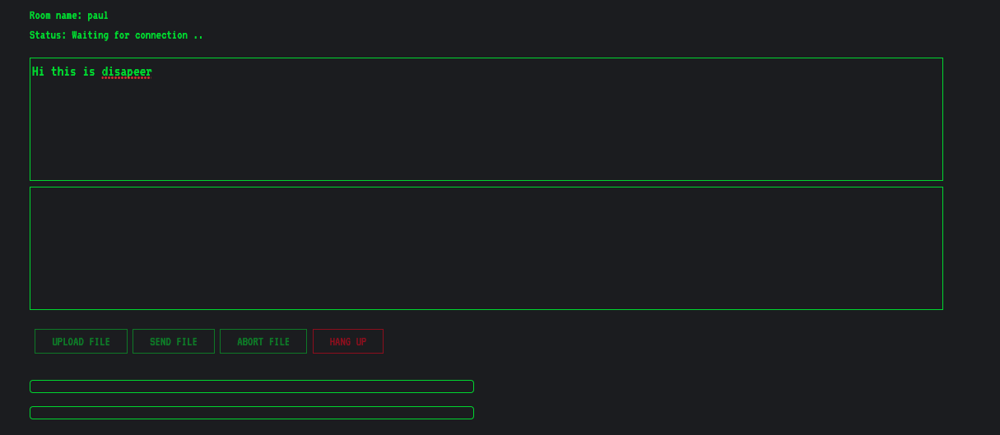
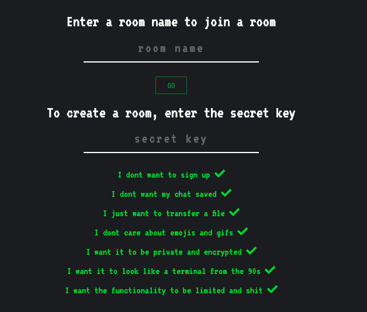

# disapeer

## WebRTC file transfer and live chat

### disapeer lets you create rooms to talk to your friends in private on your own server and also transfer files of any size via p2p connections

### the app



### create rooms



```
nvm install v10.14.2
nvm use v10.14.2
npm install
npm install bower -g
bower install
node index.js
```

### to use in production you will need to install a TURN server on your remote server

### coturn - the turnserver for disapear webrtc chat
```
sudo apt-get install coturn
nano /etc/default/coturn
nano /etc/turnserver.conf
sudo turnserver -c /etc/turnserver.conf --daemon -v
sudo service coturn restart
sudo mkdir -p /var/log/turnserver/
```